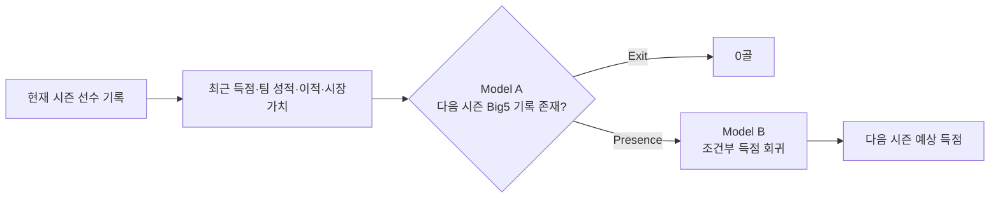

# ⚽ European Football Next-Season Goal Prediction

유럽 5대 리그에서 현재 시즌 900분 이상 출전한 FW·MF의 **다음 시즌 Big5 득점 수**를 예측한 개인 머신러닝 실험 기록입니다.

MLP 회귀에서 출발해 Walk-forward 검증, ML·DL 기준선 비교, Nested HPO, Transfermarkt 외부 피처, 라벨 감사, Two-stage 구조와 locked final test까지 단계적으로 확장했습니다.

- 예측 대상: 다음 시즌 유럽 5대 리그 득점 수
- 데이터 범위: 2000-01 → 2001-02부터 2024-25 → 2025-26까지
- 핵심 평가 기준: MAE와 시간 순서 일반화 성능
- 최종 구조: Big5 잔류 분류 + 조건부 득점 회귀를 결합한 Hard Two-stage

## 한눈에 보는 최종 결과

2024-25 시즌 정보로 2025-26 시즌을 예측한 **926명의 locked holdout** 결과입니다.

| 모델 | MAE | RMSE | R² | Bias |
| --- | ---: | ---: | ---: | ---: |
| **Hard Two-stage** | **2.003** | 3.099 | 0.406 | +0.327 |
| Direct Regression | 2.067 | **3.084** | **0.412** | +0.312 |
| Conditional Model without gate | 2.259 | 3.213 | 0.361 | +0.683 |
| 현재 시즌 득점 그대로 사용 | 2.756 | 4.120 | -0.050 | +1.298 |

Hard Two-stage는 사전 지정한 전체 MAE 기준에서 가장 좋았습니다. RMSE와 R²는 Direct Regression이 근소하게 앞서므로, 모든 지표에서 절대적으로 우월하다고 해석하지 않습니다.

### Big5 잔류 분류 성능

| Final Test 지표 | 값 |
| --- | ---: |
| ROC-AUC | **0.907** |
| Macro F1 | **0.814** |
| Exit Recall | 0.680 |
| Presence Recall | 0.936 |

> 이 분류 모델은 `10+ 득점 여부`가 아니라 **다음 시즌에도 유럽 5대 리그 기록이 존재하는지**를 예측합니다.

## 최종 예측 구조



다음 시즌 득점에는 `Big5에 남는가`와 `남는다면 몇 골을 넣는가`라는 서로 다른 사건이 섞여 있습니다. 이를 분리한 Hard gate가 이탈 선수의 0골 처리를 개선해 전체 MAE를 낮췄습니다.

## 프로젝트에서 다룬 내용

- MLP, CatBoost, XGBoost, ElasticNet, RandomForest 기준선 비교
- 시즌 순서를 보존한 Walk-forward 평가
- Outer Train 내부에서만 학습 길이와 설정을 고르는 Nested HPO
- 장기 기본 피처와 최근 고급 피처 데이터셋 비교
- 최근 3시즌 득점 이력과 이전 소속팀 성적 생성
- 예측 기준일을 지키는 Transfermarkt 시장가치·이적·새 팀 환경 통합
- `matched_next` 매칭 오류 후보 감사와 보수적 라벨 보정
- Big5 잔류 분류와 조건부 득점 회귀를 결합한 Two-stage 모델
- 리그·포지션·이적·이탈·고득점 구간별 slice error analysis
- 모델과 피처를 동결한 뒤 2025-26 시즌 locked test 1회 평가

## 평가 설계

| 구간 | 시즌 범위 | 행 수 | 역할 |
| --- | --- | ---: | --- |
| Train | 2000-01 → 2001-02 ~ 2022-23 → 2023-24 | 22,430 | 모델 학습과 Walk-forward 개발 |
| Validation | 2023-24 → 2024-25 | 923 | 최종 구조 결정 전 개발 평가 |
| Locked Test | 2024-25 → 2025-26 | 926 | 모델·피처·threshold 동결 후 최종 평가 |

축구 시즌은 시간 순서가 있으므로 랜덤 분할 대신 과거 시즌으로 학습하고 바로 다음 시즌을 평가했습니다. 평균 성능뿐 아니라 Fold 표준편차, 최악 Fold와 주요 선수군별 오차도 함께 확인했습니다.

## 모델 학습 과정

| 단계 | 핵심 질문 | 확인한 결과 |
| --- | --- | --- |
| MLP 기준선 | 기본 선수 기록으로 다음 시즌 득점을 예측할 수 있는가? | 단일 Validation MAE 2.389, R² 0.418 |
| ML·DL 비교 | 복잡한 딥러닝 모델이 전통 ML보다 강한가? | Walk-forward에서 CatBoost MAE 2.389로 근소하게 1위 |
| Nested HPO | 튜닝이 일반화 성능을 높이는가? | Tuned MLP 2.392, Tuned CatBoost 2.398로 고정 baseline을 넘지 못함 |
| 외부 피처 | 시장가치와 이적 정보가 도움이 되는가? | 선택 피처 S3 CatBoost MAE 2.383 |
| 라벨 감사 | Big5 잔류 라벨의 매칭 오류가 있는가? | 명백한 20건만 보수적으로 수정 |
| Two-stage | 이탈과 잔류 후 득점량을 분리하면 좋은가? | 개발 MAE 2.127로 Direct Regression 2.202보다 개선 |
| 안정성 검사 | 일부 피처를 제거하면 더 단순하고 강한가? | 어떤 제거안도 기준을 충족하지 못해 Full 유지 |
| Final Test | 선택한 구조가 미래 시즌에도 유지되는가? | Hard Two-stage MAE 2.003 |

### Walk-forward 기준선 비교

| 모델 | MAE |
| --- | ---: |
| CatBoost | **2.389** |
| Tuned MLP | 2.392 |
| XGBoost | 2.423 |
| Baseline MLP | 2.428 |
| ElasticNet | 2.429 |
| RandomForest | 2.435 |
| 현재 시즌 득점 그대로 사용 | 2.780 |

HPO 자체를 성과로 간주하지 않고, 동일한 Outer fold에서 고정 baseline을 이겼을 때만 채택했습니다. 이 프로젝트에서는 추가 튜닝보다 문제 구조를 두 단계로 나누는 것이 더 큰 개선을 만들었습니다.

## 데이터와 타깃

### `long_basic`

2000-01 시즌부터 공통으로 확보할 수 있는 안정적인 기본 선수 기록을 사용합니다. 최종 05~11 모델링 파이프라인의 출발점입니다.

### `recent_advanced`

2017-18 시즌부터 제공되는 xG, xAG, 슈팅, 전진 지표 등을 포함합니다. 고급 피처의 효과를 비교하기 위해 구축했지만 최종 모델 입력에는 사용하지 않았습니다.

### 타깃 정의

- `next_goals`: 다음 시즌 유럽 5대 리그 득점
- `next_10plus`: 다음 시즌 10골 이상 여부를 나타내는 분석용 타깃
- `matched_next`: 다음 시즌 Big5 기록 존재 여부이자 Model A의 정답

다음 시즌에 유럽 5대 리그 기록이 없는 선수는 `next_goals=0`으로 정의합니다. 따라서 전체 커리어·모든 대회 득점이 아니라 **다음 시즌 유럽 5대 리그 득점**을 예측합니다.

## 데이터 출처와 공개 범위

프로젝트에서 검토하거나 사용한 원본 데이터는 다음과 같습니다.

- `Player Stats From Top European Football Leagues.zip`: 2000-01~2022-23 장기 기본 선수 기록
- `Top 5 League Football Player Stats (2017-2025).zip`: 2017-18~2024-25 고급 경기 지표
- `Churn Prediction Football Players0910to2122.zip`: 중복과 품질 문제를 확인한 뒤 최종 통합에서 제외
- [eordo/transfermarkt-data](https://github.com/eordo/transfermarkt-data): 시장가치·이적·새 팀 환경 피처 구축에 사용한 Transfermarkt 파생 데이터

원천 데이터는 이 저장소 작성자가 생산한 자료가 아닙니다. 대용량 DuckDB와 외부 Transfermarkt 원천 파일은 Git에 포함하지 않으며, 재사용 시 각 원출처와 이용 조건을 별도로 확인해야 합니다. 이 저장소의 MIT 라이선스는 작성한 코드와 문서에만 적용되며 외부 데이터의 권리를 대체하지 않습니다.

## 가장 중요한 실패 패턴

| 실제 득점 구간 | 선수 수 | MAE | Bias |
| --- | ---: | ---: | ---: |
| 전체 | 926 | 2.003 | +0.327 |
| 10+ | 67 | 5.660 | -5.295 |
| 15+ | 22 | 7.172 | -6.995 |
| 20+ | 5 | 10.426 | -9.954 |

전체 MAE를 최소화하는 모델은 다수의 저득점자에 맞추면서 소수 고득점자의 예측을 평균 쪽으로 축소했습니다. 따라서 이 모델은 전체 선수의 기대 득점 예측에는 유효하지만, 차세대 득점왕 발굴 모델로 사용하기에는 한계가 있습니다.

## 핵심 노트북

| 단계 | 노트북 | 내용 |
| --- | --- | --- |
| 데이터 이해 | [`01_long_basic_data_understanding.ipynb`](notebooks/01_long_basic_data_understanding.ipynb) | 데이터 구조, 상관관계, 이상값 판단 |
| MLP 기준선 | [`03_long_basic_mlp_regression.ipynb`](notebooks/03_long_basic_mlp_regression.ipynb) | 기본 MLP 회귀 |
| Walk-forward | [`05_walk_forward_evaluation.ipynb`](notebooks/05_walk_forward_evaluation.ipynb) | 시간축 평가 프로토콜 |
| ML·DL 비교 | [`06_ml_dl_baseline_comparison.ipynb`](notebooks/06_ml_dl_baseline_comparison.ipynb) | 주요 모델 기준선 비교 |
| Nested HPO | [`07_nested_hpo_catboost_mlp.ipynb`](notebooks/07_nested_hpo_catboost_mlp.ipynb) | CatBoost·MLP 튜닝 검증 |
| 외부 피처 | [`08_03_selected_external_feature_validation.ipynb`](notebooks/08_03_selected_external_feature_validation.ipynb) | 시장가치·이적 피처 선택 |
| 라벨 감사 | [`09_01A_matched_next_label_audit.ipynb`](notebooks/09_01A_matched_next_label_audit.ipynb) | Big5 매칭 라벨 감사 |
| Two-stage | [`09_02_two_stage_integration.ipynb`](notebooks/09_02_two_stage_integration.ipynb) | Model A와 Model B 통합 |
| 안정성 검사 | [`10_selected_feature_stability_check.ipynb`](notebooks/10_selected_feature_stability_check.ipynb) | 선택 피처 ablation |
| 최종 평가 | [`11_final_test_slice_error_analysis_v3.ipynb`](notebooks/11_final_test_slice_error_analysis_v3.ipynb) | locked test와 slice 분석 |

전체 판단 근거와 수치는 [프로젝트 지식 문서](docs/PROJECT_KNOWLEDGE.md), 노트북별 결정 기록은 [실험 결정 문서](docs/EXPERIMENT_DECISIONS.md)를 참고하세요.

## 저장소 구조

```text
european-football-goal-prediction/
├── data/
│   ├── long_basic/                  # 장기 기본 피처 데이터
│   └── recent_advanced/             # 최근 고급 피처 비교 데이터
├── docs/
│   ├── PROJECT_KNOWLEDGE.md         # 전체 프로젝트 지식과 최종 결론
│   └── EXPERIMENT_DECISIONS.md      # 노트북별 실험 결정
├── notebooks/
│   ├── 01_...ipynb ~ 11_...ipynb  # 단계별 실험
│   └── artifacts/                   # 집계 지표·프로토콜·감사 결과
├── requirements.txt
└── README.md
```

## 환경 구성

Python 3.11 환경을 권장합니다. Windows PowerShell 기준입니다.

```powershell
python -m venv .venv
.\.venv\Scripts\Activate.ps1
python -m pip install --upgrade pip
python -m pip install -r requirements.txt
python -m jupyter lab
```

대용량 DuckDB와 외부 Transfermarkt 원천 데이터는 Git에 포함하지 않습니다. 저장된 노트북과 집계 artifact로 실험 코드와 주요 결과를 검토할 수 있으며, 전체 재실행에는 각 데이터 출처에서 준비한 원천 파일이 필요합니다.

## 해석 시 주의사항

- Final Test는 모델과 피처 선택이 끝난 뒤 한 번만 평가했습니다.
- 개발 데이터에는 보수적으로 감사한 라벨을 사용했지만 Final Test에는 사후 보정하지 않은 원본 locked 라벨을 사용했습니다.
- `matched_next`는 Model A의 타깃이며 회귀 입력 피처로 사용하면 누수가 발생합니다.
- 0.01골 수준의 차이를 통계적 근거 없이 큰 개선으로 해석하지 않습니다.
- Final Test 결과를 확인한 뒤 모델·피처·threshold를 다시 선택하지 않습니다.
