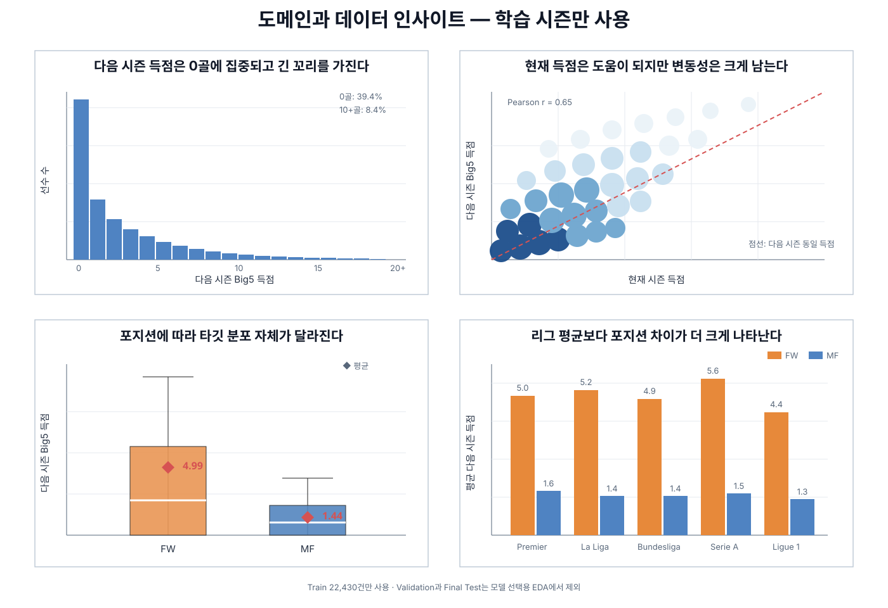
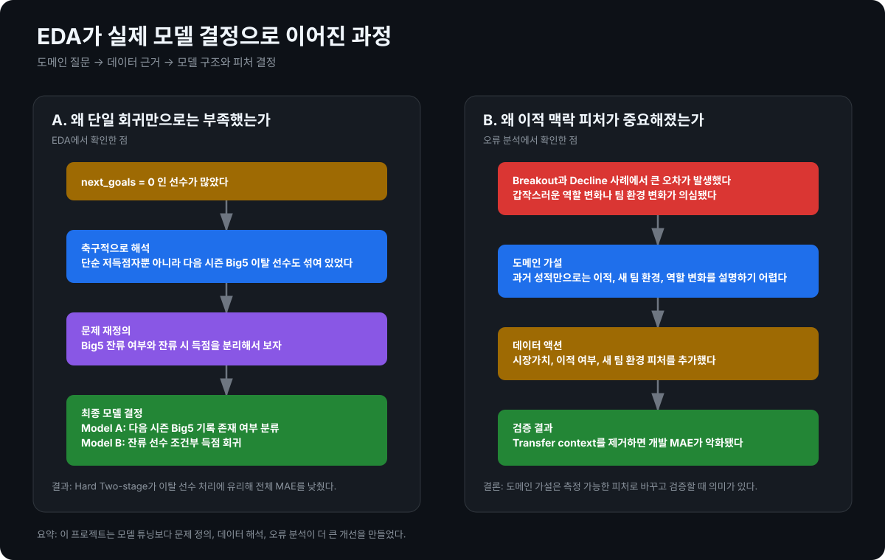
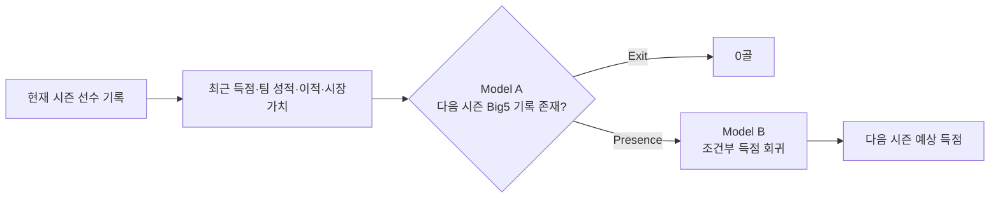
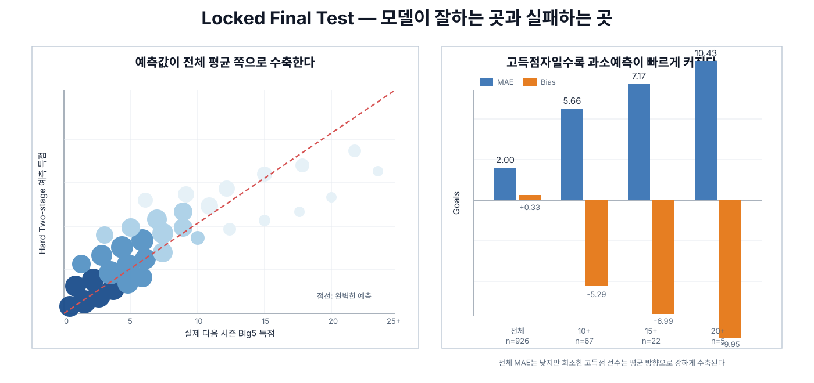

# ⚽ European Football Next-Season Goal Prediction

유럽 5대 리그에서 현재 시즌 900분 이상 출전한 FW·MF의 **다음 시즌 Big5 득점 수**를 예측한 개인 머신러닝 프로젝트입니다.

처음에는 MLP 회귀 실습으로 시작했지만, 실제 성능을 개선하는 과정에서 핵심은 모델 복잡도가 아니라 **축구 도메인에 맞는 문제 정의, 데이터 품질, 시간축 평가, 오류 분석**이라는 점을 확인했습니다.

- 예측 대상: 다음 시즌 유럽 5대 리그 득점 수
- 데이터 범위: 2000-01 → 2001-02부터 2024-25 → 2025-26까지
- 대상 선수: FW·MF, 현재 시즌 900분 이상 출전
- 핵심 평가 기준: MAE와 시간 순서 일반화 성능
- 최종 구조: Big5 잔류 분류 + 조건부 득점 회귀를 결합한 Hard Two-stage

## 한눈에 보는 최종 결과

2024-25 시즌 정보로 2025-26 시즌을 예측한 **926명의 locked holdout** 결과입니다.

| 모델 | MAE | RMSE | R² | Bias |
| --- | ---: | ---: | ---: | ---: |
| **Hard Two-stage** | **2.003** | 3.099 | 0.406 | +0.327 |
| Direct Regression | 2.067 | **3.084** | **0.412** | +0.312 |
| Conditional Model without gate | 2.259 | 3.213 | 0.361 | +0.683 |
| 현재 시즌 득점 그대로 사용 | 2.756 | 4.120 | -0.050 | +1.298 |

Hard Two-stage는 사전 지정한 전체 MAE 기준에서 가장 좋았습니다. 다만 RMSE와 R²는 Direct Regression이 근소하게 앞서므로, 모든 지표에서 절대적으로 우월하다고 해석하지 않습니다.

### Big5 잔류 분류 성능

| Final Test 지표 | 값 |
| --- | ---: |
| ROC-AUC | **0.907** |
| Macro F1 | **0.814** |
| Exit Recall | 0.680 |
| Presence Recall | 0.936 |

> 이 분류 모델은 `10+ 득점 여부`가 아니라 **다음 시즌에도 유럽 5대 리그 기록이 존재하는지**를 예측합니다.

---

## 💡 이 프로젝트에서 얻은 가장 큰 배움

> **도메인 지식은 정답을 주지 않았습니다. 대신 어떤 질문을 해야 하는지 알려줬습니다.**

이 프로젝트의 핵심 성과는 가장 복잡한 모델을 만든 것이 아니라, **축구 도메인에 맞는 타깃과 평가 시점을 정의하고 데이터 품질을 점검한 뒤, EDA와 오류 분석을 근거로 모델 구조를 선택한 것**입니다.

모델을 개선하기 전에 먼저 다음 질문에 답해야 했습니다.

- ‘다음 시즌 득점’은 어느 리그와 대회를 기준으로 할 것인가?
- 다음 시즌 Big5 기록이 없는 선수는 결측인가, 0골인가?
- 현재 시즌을 잘 보낸 선수가 다음 시즌에도 같은 득점을 기록하는가?
- FW와 MF를 같은 분포로 학습해도 되는가?
- 고득점자는 제거할 이상값인가, 반드시 예측해야 할 핵심 사례인가?
- 이적·시장가치 정보는 실제 예측 시점에 알 수 있었던 정보인가?

이 질문들을 다음의 반복 과정으로 검증했습니다.

```text
축구 도메인 이해
    ↓
가설
    ↓
데이터 수집·EDA·감사
    ↓
시간 순서를 지킨 실험
    ↓
오류 분석
    ↓
피처·타깃·문제 구조 재설계
    ↺
```

예를 들어 `team`과 `player`를 단순 식별자로 제거하는 대신, "팀 수준과 선수의 지속적인 득점력이 다음 시즌 결과에 영향을 주지 않을까?"라는 질문에서 출발했습니다. 이후 팀 성적, 최근 3시즌 득점 이력, 시장가치, 이적·새 팀 환경처럼 **현실의 축구 맥락을 관측 가능한 피처로 바꾸고 실제 시간축 검증으로 확인**했습니다.

또한 통계적으로 큰 값이라고 해서 모두 이상치로 제거하지 않았습니다. 고득점자는 이 프로젝트가 예측해야 할 핵심 사례인 반면, 비정상적인 `starts`, `minutes`, 중복·매칭 오류는 데이터 품질 문제로 구분했습니다.

## EDA가 바꾼 모델링 결정



> **위 시각화는 Train 22,430건만 사용했습니다. Validation과 Final Test의 분포는 모델 선택을 위한 EDA에 사용하지 않았습니다.**

| 데이터에서 본 것 | 축구적으로 해석 | 모델링 결정 |
| --- | --- | --- |
| `next_goals`는 0골에 집중되고 오른쪽 꼬리가 긴 분포 | 저득점과 다음 시즌 Big5 이탈이라는 서로 다른 사건이 함께 섞임 | Presence + Conditional Goals Two-stage로 문제 분리 |
| 현재 득점 ↔ 다음 시즌 득점 상관 약 0.65 | 득점력은 어느 정도 지속되지만 시즌 간 변화 폭도 큼 | 현재 득점 복사 대신 최근 이력·팀 환경과 함께 학습 |
| FW 다음 시즌 평균 약 4.99골, MF 약 1.44골 | 포지션별 득점 구조와 예측 난이도가 다름 | `position_group` 유지 + 포지션별 slice 평가 |
| 리그 평균 차이보다 포지션 차이가 큼 | 단순 리그 구분보다 역할 차이가 더 강한 신호 | 리그별 모델 분리보다 포지션 효과를 우선 반영 |
| 실제 고득점자가 분포의 긴 꼬리를 형성 | 통계적 극단값이지만 제거할 노이즈가 아니라 핵심 예측 대상 | IQR 일괄 제거 대신 10+/15+/20+ 오류를 별도 추적 |
| 선수 이동과 시즌별 분포가 시간에 따라 변함 | 미래 시즌 예측은 독립·동일분포 랜덤 샘플 문제가 아님 | 랜덤 분할 대신 Walk-forward 검증 채택 |

### EDA가 실제 모델 결정으로 이어진 과정



이 프로젝트에서 EDA는 모델링 전에 한 번 하고 끝나는 절차가 아니라, **오류 분석이 다시 다음 데이터와 가설로 이어지는 반복 과정**이었습니다.

대표적인 예는 두 가지입니다.

1. **0골의 의미 재해석**  
   `next_goals=0`에는 실제 저득점자와 다음 시즌 Big5 기록이 사라진 선수가 함께 섞여 있었습니다. 그래서 하나의 회귀 문제를 `Big5에 남는가?`와 `남는다면 몇 골인가?`로 분해했습니다.

2. **Breakout / Decline 오류에서 이적 맥락 발견**  
   과거 기록만으로 급격한 득점 변화가 잘 설명되지 않아 시장가치, 이적 여부, 새 팀 환경을 추가했습니다. Transfer context를 제거하면 선택 구조의 개발 MAE가 약 2.127에서 2.211로 악화되어, 실제로 도움이 되는 맥락임을 확인했습니다.

## 데이터 품질도 모델의 일부였다

모델링 과정에서 원본 데이터 자체의 품질 문제도 중요한 변수였습니다.

- 완전 중복 및 비정상 행 증식 여부 확인
- 선수·시즌·팀 매칭 오류 후보 감사
- 비정상적으로 큰 `starts`, `minutes`를 단순 선수 이상값이 아닌 원본 집계 문제 후보로 분리
- `matched_next=False` 전체를 실제 이탈로 간주하지 않고 명백한 모순 **20건만 보수적으로 수정**
- 예측 시점 이후 정보를 사용하지 않도록 Transfermarkt 데이터에 **cutoff 적용**
- `matched_next`는 Model A의 타깃으로만 사용하고 회귀 입력에서는 제외

라벨 감사 후 Model A의 ROC-AUC는 약 0.912에서 0.924로, Macro F1은 약 0.820에서 0.833으로 좋아졌습니다. 반면 Model B MAE는 약 2.388에서 2.397로 소폭 나빠졌습니다.

이는 **데이터 정제가 항상 점수를 높이지는 않는다**는 사례였습니다. 어려운 사례가 잘못 제외되어 있었다면, 데이터를 더 정직하게 고친 뒤 모델 점수가 나빠지는 것이 오히려 정상일 수 있습니다.

결과적으로 이 프로젝트에서는 HPO보다 **타깃 정의, 시간축 평가, 선수·팀 매칭과 이적 시점 정합성**을 바로잡는 과정이 더 중요한 개선을 만들었습니다.

## 평가 설계

| 구간 | 시즌 범위 | 행 수 | 역할 |
| --- | --- | ---: | --- |
| Train | 2000-01 → 2001-02 ~ 2022-23 → 2023-24 | 22,430 | 모델 학습과 Walk-forward 개발 |
| Validation | 2023-24 → 2024-25 | 923 | 최종 구조 결정 전 개발 평가 |
| Locked Test | 2024-25 → 2025-26 | 926 | 모델·피처·threshold 동결 후 최종 평가 |

축구 시즌은 시간 순서가 있으므로 랜덤 분할 대신 과거 시즌으로 학습하고 바로 다음 시즌을 평가했습니다.

- Walk-forward 검증
- Fold 평균·표준편차·최악 Fold 확인
- Validation에서 모델·피처·threshold 선택
- Test 결과를 보기 전에 최종 구조 동결
- Final Test 결과 확인 후 재선택 금지
- 전체 MAE뿐 아니라 포지션·리그·이적·이탈·고득점 slice 평가

## 모델링 여정

| 단계 | 핵심 질문 | 확인한 결과 |
| --- | --- | --- |
| MLP 기준선 | 기본 선수 기록으로 다음 시즌 득점을 예측할 수 있는가? | 단일 Validation MAE 2.389, R² 0.418 |
| ML·DL 비교 | 복잡한 딥러닝 모델이 전통 ML보다 강한가? | Walk-forward에서 CatBoost MAE 2.389로 근소하게 1위 |
| Nested HPO | 튜닝이 일반화 성능을 높이는가? | Tuned MLP 2.392, Tuned CatBoost 2.398로 고정 baseline을 넘지 못함 |
| 외부 피처 | 시장가치와 이적 정보가 도움이 되는가? | 선택 피처 S3 CatBoost MAE 2.383 |
| 라벨 감사 | Big5 잔류 라벨의 매칭 오류가 있는가? | 명백한 20건만 보수적으로 수정 |
| Two-stage | 이탈과 잔류 후 득점량을 분리하면 좋은가? | 개발 MAE 2.127로 Direct Regression 2.202보다 개선 |
| 안정성 검사 | 일부 피처를 제거하면 더 단순하고 강한가? | 어떤 제거안도 기준을 충족하지 못해 Full 유지 |
| Final Test | 선택한 구조가 미래 시즌에도 유지되는가? | Hard Two-stage MAE 2.003 |

### Walk-forward 기준선 비교

| 모델 | MAE |
| --- | ---: |
| CatBoost | **2.389** |
| Tuned MLP | 2.392 |
| XGBoost | 2.423 |
| Baseline MLP | 2.428 |
| ElasticNet | 2.429 |
| RandomForest | 2.435 |
| 현재 시즌 득점 그대로 사용 | 2.780 |

HPO 자체를 성과로 간주하지 않고, 동일한 Outer fold에서 고정 baseline을 이겼을 때만 채택했습니다. 이 프로젝트에서는 **추가 튜닝보다 데이터와 문제 구조를 다시 정의하는 변화가 더 큰 개선**으로 이어졌습니다.

## 최종 예측 구조



다음 시즌 득점에는 `Big5에 남는가`와 `남는다면 몇 골을 넣는가`라는 서로 다른 사건이 섞여 있습니다. 이를 분리한 Hard gate가 이탈 선수의 0골 처리를 개선해 전체 MAE를 낮췄습니다.

- Model A: Fixed CatBoost Classifier
- Model B: Fixed CatBoost Regressor S3
- Hard Gate threshold: 0.67
- Feature Set: FULL 유지

## 가장 중요한 실패 패턴



| 실제 득점 구간 | 선수 수 | MAE | Bias |
| --- | ---: | ---: | ---: |
| 전체 | 926 | 2.003 | +0.327 |
| 10+ | 67 | 5.660 | -5.295 |
| 15+ | 22 | 7.172 | -6.995 |
| 20+ | 5 | 10.426 | -9.954 |

전체 MAE를 최소화하는 모델은 다수의 저득점자에 맞추면서 소수 고득점자의 예측을 평균 쪽으로 축소했습니다. 실제 득점이 높아질수록 완벽한 예측선 아래에 위치하는 사례가 많아지고, 10+/15+/20+ 구간으로 갈수록 음의 Bias가 빠르게 커집니다.

즉 이 모델은 **전체 선수의 기대 득점 예측에는 유효하지만, 차세대 득점왕 발굴 모델로 바로 사용하기에는 한계**가 있습니다. 특히 breakout·decline은 다음과 같은 정보가 충분하지 않으면 구조적으로 예측하기 어렵습니다.

- 다음 시즌 예상 출전시간 급증·급감
- 감독 및 전술 변화
- 역할·포지션 변화
- PK 전담 여부
- 부상과 회복
- 동료 변화
- 슈팅 기회와 xG profile 변화

## 데이터와 타깃

### `long_basic`

2000-01 시즌부터 공통으로 확보할 수 있는 안정적인 기본 선수 기록입니다. 최종 05~11 모델링 파이프라인의 출발점입니다.

### `recent_advanced`

2017-18 시즌부터 제공되는 xG, xAG, 슈팅, 전진 지표 등을 포함합니다. 고급 피처의 효과를 비교하기 위해 구축했지만 **최종 모델 입력에는 사용하지 않았습니다.**

### 타깃 정의

- `next_goals`: 다음 시즌 유럽 5대 리그 득점
- `next_10plus`: 다음 시즌 10골 이상 여부를 나타내는 분석용 타깃
- `matched_next`: 다음 시즌 Big5 기록 존재 여부이자 Model A의 정답

다음 시즌에 유럽 5대 리그 기록이 없는 선수는 `next_goals=0`으로 정의합니다. 따라서 전체 커리어·모든 대회 득점이 아니라 **다음 시즌 유럽 5대 리그 득점**을 예측합니다.

## 데이터 출처와 공개 범위

프로젝트에서 검토하거나 사용한 원본 데이터는 다음과 같습니다.

- `Player Stats From Top European Football Leagues.zip`: 2000-01~2022-23 장기 기본 선수 기록
- `Top 5 League Football Player Stats (2017-2025).zip`: 2017-18~2024-25 고급 경기 지표
- `Churn Prediction Football Players0910to2122.zip`: 중복과 품질 문제를 확인한 뒤 최종 통합에서 제외
- [eordo/transfermarkt-data](https://github.com/eordo/transfermarkt-data): 시장가치·이적·새 팀 환경 피처 구축에 사용한 Transfermarkt 파생 데이터

원천 데이터는 이 저장소 작성자가 생산한 자료가 아닙니다. 대용량 DuckDB와 외부 Transfermarkt 원천 파일은 Git에 포함하지 않으며, 재사용 시 각 원출처와 이용 조건을 별도로 확인해야 합니다. 이 저장소의 MIT 라이선스는 작성한 코드와 문서에만 적용되며 외부 데이터의 권리를 대체하지 않습니다.

## 프로젝트에서 얻은 교훈

1. **도메인 지식은 피처의 정답이 아니라 좋은 가설을 만든다.**  
   팀 이름 자체보다 팀 공격력과 성적을 표현하는 수치가 유용했고, 선수 이름을 외우게 하기보다 최근 기록으로 선수의 지속적인 능력을 표현하는 편이 더 일반화 가능한 접근이었다.

2. **통계적 이상값과 데이터 오류는 다르다.**  
   20골 이상 고득점자는 제거해야 할 노이즈가 아니라 가장 중요한 사례였고, 반대로 비정상적인 출전 기록과 매칭 오류는 감사 대상이었다.

3. **데이터가 없는 미래 변화는 모델 구조만으로 해결하기 어렵다.**  
   breakout과 decline 오류를 통해 이적, 역할, 출전기회, 전술 변화 같은 맥락의 중요성을 확인했다.

4. **데이터 정제가 항상 점수를 높이지는 않는다.**  
   잘못 제외된 어려운 사례를 복원하면 점수가 나빠질 수도 있으며, 그것이 더 정직한 평가일 수 있다.

5. **HPO보다 문제 정의가 더 큰 개선을 만들 수 있다.**  
   Nested HPO는 baseline을 이기지 못했지만, 타깃을 Presence와 Conditional Goals로 나눈 Two-stage 구조는 개발과 locked test에서 의미 있는 개선을 만들었다.

6. **평가 프로토콜도 모델의 일부다.**  
   시간축 검증과 locked test를 적용하지 않았다면 특정 시즌에 맞춘 선택을 일반화 성능으로 오해할 수 있었다.

> 좋은 모델링은 모델 선택에서 시작하지 않습니다. **현실의 문제를 데이터로 어떻게 표현하고, 그 가설을 어떻게 검증할지를 설계하는 것에서 시작합니다.**

## 다음 확장 방향

현재 프로젝트는 시즌 단위 Tabular 데이터로 `next_goals`를 직접 예측했습니다. 다음 단계에서는 실제 축구 데이터 분석 업무와 더 가까운 Event / Tracking 기반 문제로 확장할 수 있습니다.

```text
Event Data
  ↓
xG
  ↓
Action / Possession Value
  ↓
Player Profile
  ↓
Similar Player / Recruitment Recommendation
  ↓
Sequence DL · Tracking · GNN
```

특히 `Event Data → xG → Action Value → Player Profile → Recruitment Recommendation` 흐름은 현재 프로젝트에서 얻은 도메인·데이터 설계 경험을 자연스럽게 확장할 수 있는 다음 주제입니다.

## 핵심 노트북

| 단계 | 노트북 | 내용 |
| --- | --- | --- |
| 데이터 이해 | [`01_long_basic_data_understanding.ipynb`](notebooks/01_long_basic_data_understanding.ipynb) | 데이터 구조, 상관관계, 이상값 판단 |
| MLP 기준선 | [`03_long_basic_mlp_regression.ipynb`](notebooks/03_long_basic_mlp_regression.ipynb) | 기본 MLP 회귀 |
| Walk-forward | [`05_walk_forward_evaluation.ipynb`](notebooks/05_walk_forward_evaluation.ipynb) | 시간축 평가 프로토콜 |
| ML·DL 비교 | [`06_ml_dl_baseline_comparison.ipynb`](notebooks/06_ml_dl_baseline_comparison.ipynb) | 주요 모델 기준선 비교 |
| Nested HPO | [`07_nested_hpo_catboost_mlp.ipynb`](notebooks/07_nested_hpo_catboost_mlp.ipynb) | CatBoost·MLP 튜닝 검증 |
| 외부 피처 | [`08_03_selected_external_feature_validation.ipynb`](notebooks/08_03_selected_external_feature_validation.ipynb) | 시장가치·이적 피처 선택 |
| 라벨 감사 | [`09_01A_matched_next_label_audit.ipynb`](notebooks/09_01A_matched_next_label_audit.ipynb) | Big5 매칭 라벨 감사 |
| Two-stage | [`09_02_two_stage_integration.ipynb`](notebooks/09_02_two_stage_integration.ipynb) | Model A와 Model B 통합 |
| 안정성 검사 | [`10_selected_feature_stability_check.ipynb`](notebooks/10_selected_feature_stability_check.ipynb) | 선택 피처 ablation |
| 최종 평가 | [`11_final_test_slice_error_analysis_v3.ipynb`](notebooks/11_final_test_slice_error_analysis_v3.ipynb) | locked test와 slice 분석 |

전체 판단 근거와 수치는 [프로젝트 지식 문서](docs/PROJECT_KNOWLEDGE.md), 노트북별 결정 기록은 [실험 결정 문서](docs/EXPERIMENT_DECISIONS.md)를 참고하세요.

## 저장소 구조

```text
european-football-goal-prediction/
├── data/
│   ├── long_basic/                  # 장기 기본 피처 데이터
│   └── recent_advanced/             # 최근 고급 피처 비교 데이터
├── docs/
│   ├── assets/                      # README 시각화
│   ├── PROJECT_KNOWLEDGE.md         # 전체 프로젝트 지식과 최종 결론
│   └── EXPERIMENT_DECISIONS.md      # 노트북별 실험 결정
├── notebooks/
│   ├── 01_...ipynb ~ 11_...ipynb  # 단계별 실험
│   └── artifacts/                   # 집계 지표·프로토콜·감사 결과
├── requirements.txt
└── README.md
```

## 환경 구성

Python 3.11 환경을 권장합니다. Windows PowerShell 기준입니다.

```powershell
python -m venv .venv
.\.venv\Scripts\Activate.ps1
python -m pip install --upgrade pip
python -m pip install -r requirements.txt
python -m jupyter lab
```

대용량 DuckDB와 외부 Transfermarkt 원천 데이터는 Git에 포함하지 않습니다. 저장된 노트북과 집계 artifact로 실험 코드와 주요 결과를 검토할 수 있으며, 전체 재실행에는 각 데이터 출처에서 준비한 원천 파일이 필요합니다.

## 해석 시 주의사항

- Final Test는 모델과 피처 선택이 끝난 뒤 한 번만 평가했습니다.
- 개발 데이터에는 보수적으로 감사한 라벨을 사용했지만 Final Test에는 사후 보정하지 않은 원본 locked 라벨을 사용했습니다.
- `matched_next`는 Model A의 타깃이며 회귀 입력 피처로 사용하면 누수가 발생합니다.
- 0.01골 수준의 차이를 통계적 근거 없이 큰 개선으로 해석하지 않습니다.
- Final Test 결과를 확인한 뒤 모델·피처·threshold를 다시 선택하지 않습니다.